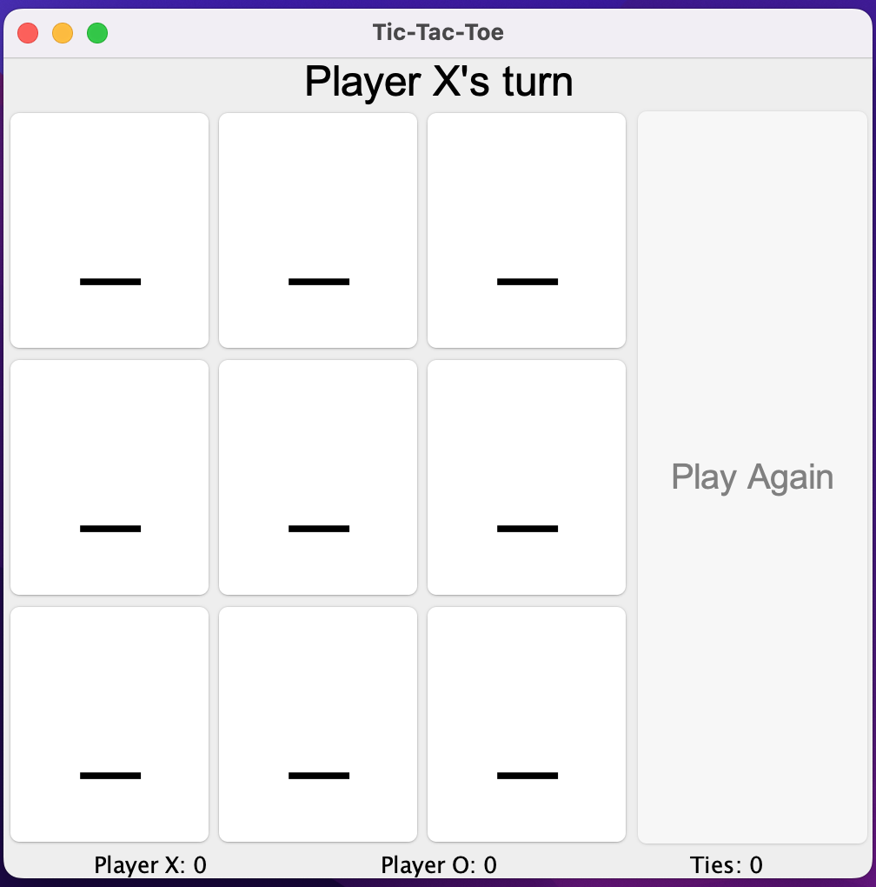
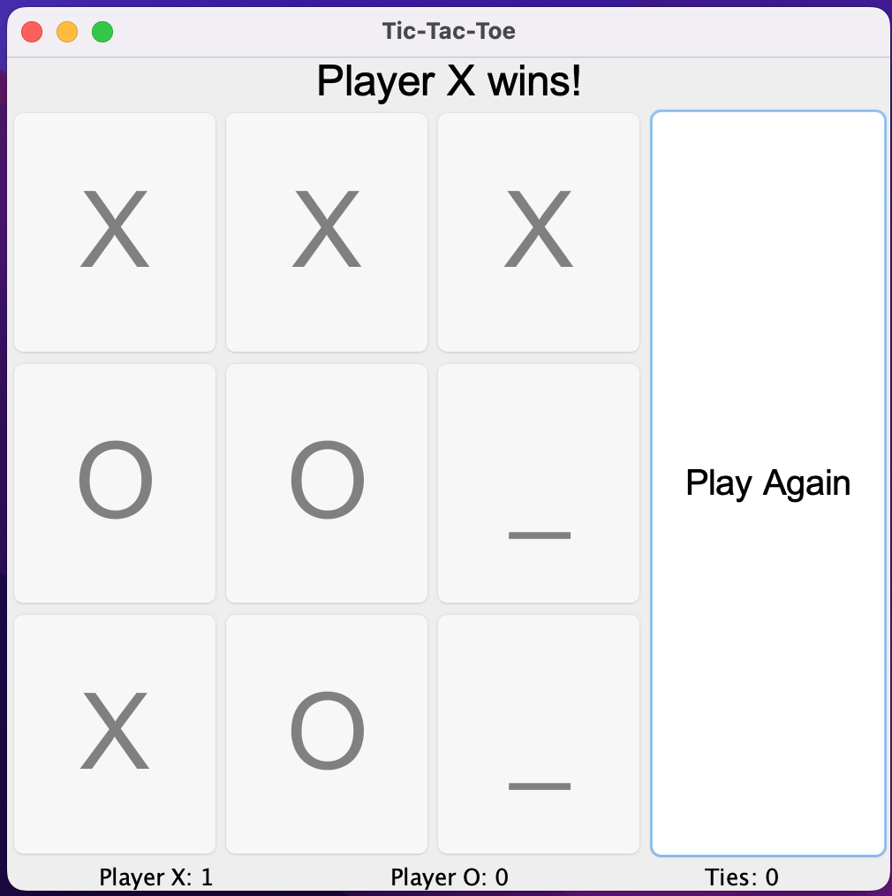
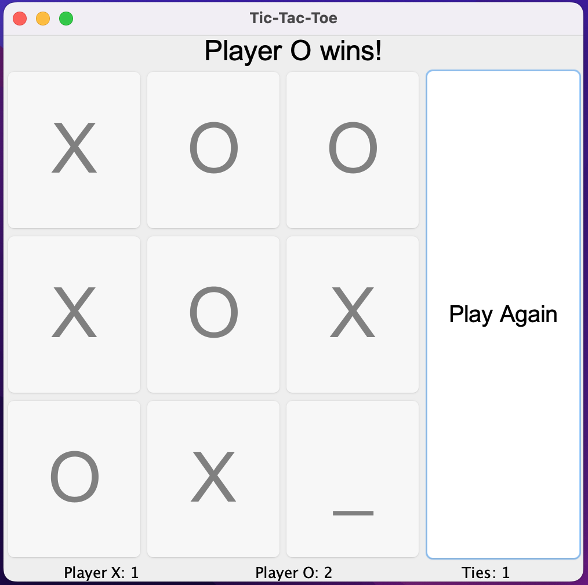

# Tic-Tac-Toe Game (Java Swing)

This project is a graphical implementation of the classic Tic-Tac-Toe game using **Java Swing**. Players take turns playing as 'X' and 'O', and the game includes features such as a color-coded grid, replay functionality, and a scoreboard to track wins and ties.

## Features

- **TicTacToe Game**: Fully implement tic-tac-toe logic with wins and ties.
- **Scoreboard**: The game keeps track of the number of wins for Player X, Player O, and the number of ties.
- **Replay Option**: After the game ends, players can easily start a new round by clicking the "Play Again" button.

## How to Run

1. **Clone the repository**:
   ```bash
   git clone git@github.com:melaniefayne/TicTacToeJava.git

## GUI

- Initial Game State

   

<br>

- Player X wins

   

<br>

- Scoreboard after multiple games

   

<br>
